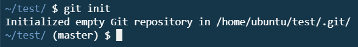

c9 c# GitHub Tutorial

_by Yuhong Zhao_

---
## Git vs. GitHub
Git is a version control system where we can use to keep track of the work. Github is a website service where we can host our code and we can also collaborate with other users. Generally, Git is a command-line tool that can be used independently. While Github is a code hosting service that requires Git for version control.

---
## Initial Setup
Before we start using Git, we would have to do some additional one-time steps. We will need a Github account. If you don’t currently have one you can go [here](https://github.com/join?source=header-home) to create a new account).
1. Basic information
    * Enter your desired username, email address, and password
    * Complete the Captcha
2. Plan
    *For beginners, pick the free plans
3. Complete Setup
    * Enter your responses according to the questions and click *Complete Setup*
    *If you don’t want to do this, you can skip this by clicking *Skip this step* at the end
4. Verify your email address
    * GitHub will send you an email to the email address you’ve provided and just open the link in that email to verify your account.

Once you have an account, we will need an IDE (Integrated development environment) to type your codes. Your IDE would be your local IDE and will contain files locally. Local IDE runs off your computer using your computer’s resources. Here we will be using [ide.cs50.io](https://ide.cs50.io)  as our IDE. This is a remote IDE because it runs off a server somewhere else in the world. Each type of IDE have their benefits and drawbacks, but using a remote IDE would be more beneficial, especially if you are a beginner. One of the biggest benefits is you will not be able to mess up and corrupt your system because you are constrained in a *box*. Unlike a local IDE, you have access to your computer’s file; but if you don’t know what you doing and accidentally deleted something, it can cause your system to crash. 
#### [Directions to set up your IDE](https://github.com/hstatsep/ide50)

---
## Repository Setup
To initialize Git, you would need to create a directory that will contain your project. A directory is a file system folder where we put our files, such as documents, images, and videos. Once you have created a directory, navigate to your directory by using `cd <filename>`. Then, using `git init` to get git started and running. This means that your directory will be converted to a repository.  A repository is a version control system where developers and software engineers stores their code. You can also see the `(master)` next to the command prompt.  

>  In other words, a directory is just a folder that does not have git running, while on the other hand, a repository is a folder that has git running. We also call it a **repo** for short.

**Congratulations! You now have git running!**  
As you work on your projects — making and modifying files, it is important to take a *snapshot* of your code. Taking a *snapshot* or committing in git means saving the changes you’ve made till now. Before committing your files, it’s important to use `git status` to tell you which files are ready to commit. Files in red means they have been modified but have not yet added to the staging area. 

Files in green means they have been modified but is currently in the staging area and ready to be committed.  

To take a *snapshot* of your code, you must first add the files you want to commit to the staging area by using `git add <filename>`. You can add more than one file to the staging area by adding a space between each file name. You can also use `git add .` to add all the files in red.
It’s recommended to use `git status` again to see if you have added the files properly. The files that were in red before should be in green. Once all your desired files have been added to the staging area, you can use the command `git commit -m “<message>”` to commit.  

You can attach messages to each commit you do, so you keep a note of what does each commit did. Commit messages should be meaningful and in the present tense, Below are examples of good and bad examples.

Once you have made some changes and committed those changes, you will need to put your code live. To do so, you would need to *push* your files to a remote server such as GitHub. Before pushing to GitHub, you will need to head over to the [website](www.github.com) to make a repository with the **same name** as your repository in your IDE. We will *bridge* your local repo and your remote repo. Bridging or connecting your local repo and your remote repo is important because it allows you to push your files to a remote server to be lived after you finish adding and editing codes in your IDE. If you tried to push your files to a remote server without bridging your IDE and your GitHub account, you would receive an error.

#####Directions to bridge your local and remote repo:
1. After you created a repo in GitHub with the same name as the one in your local IDE, scroll down to find the **`…or push an existing repository from the command line`** sections.
* Here, you will find two commands.

2. Copy the first command and paste it into your IDE and press enter. 
3. Copy the second command and paste it into your IDE and press enter.
* You must have committed at least one or else you will receive an error.

4. Enter the following code into your command line: `git remote -v`
* If you get similar feedback to the image, then successfully connected your local repo to your remote repo. 

* Whenever you push your repo to a remote repo, you would not need to do these steps. You will just need to do `git push` to push your files.

---
## Workflow & Commands
**Congratulation! You now have git running!**    
As you work on your projects — making and modifying files, it is important to take a *snapshot* of your code. Taking a *snapshot* or committing in git means saving the changes you’ve made till now. Before committing your files, it’s important to use `git status` to tell you which files are ready to commit. Files in red means they have been modified but have not yet added to the staging area. Files in green means they have been modified but is currently in the staging area and ready to be committed.  
To take a *snapshot* of your code, you must first add the files you want to commit to the staging area by using `git add <filename>`. You can add more than one file to the staging area by adding a space between each file name. You can also use `git add .` to add all the files in red.  
It’s recommended to use `git status` again to see if you have added the files properly. The files that were in red before should be in green. Once all your desired files have been added to the staging area, you can use the command `git commit -m “<message>”` to commit.   
You can attach messages to each commit you do, so you keep a note of what does each commit did. Commit messages should be meaningful and in the present tense, Below are examples of good and bad examples.  

---
## Rolling Back Changes
Once you have saved many changes, you can use `git log` to view all the commits you have made. What if you have made some errors and you want to go back to the last commit that you’ve made? It is recommended to use ‘`git diff` to show you any changes you’ve made ever since the last commit. Texts that you have added will be highlighted in green along with a `+`, while texts that you have deleted will be highlighted in red. You can use the command `git checkout -- <filename>` to discard any changes you have made — *texts in green would be deleted and texts in red would come back*.  After discarding any changes you can use `git diff` again to make sure you did it correctly. It should respond with nothing.
* your files must not be on the stage in order to use `git diff` and `git checkout` correctly.  

What if you accidentally added your files to the staging area and you want to remove the files off from the stage so you can use `git diff` and `git checkout`? Well, you can always unstage a file by using `git reset HEAD <filename>`. Just be sure to replace the `<filename>` with the actual name of the file you want to unstage. 
>NOTE: If you ever forget the command for unstaging and discarding changes, you can always use `git status` to find the command.

---
